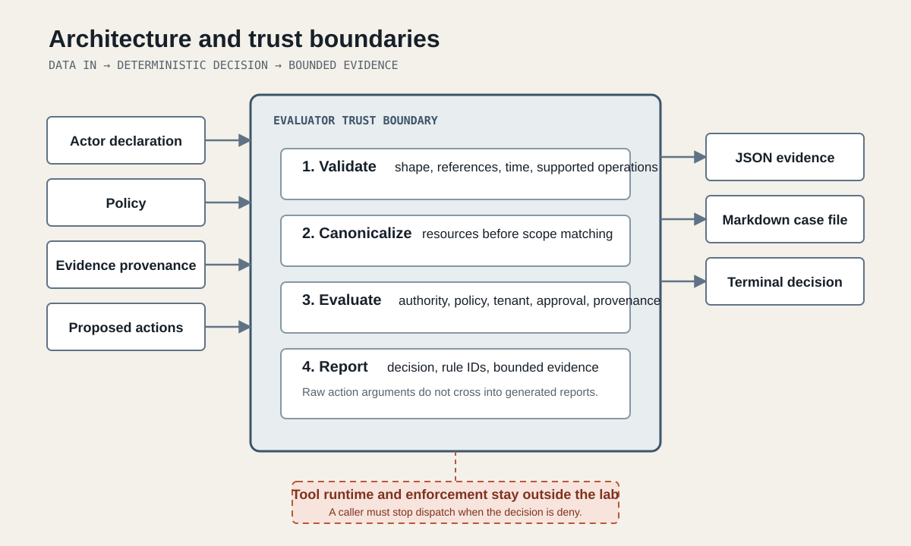
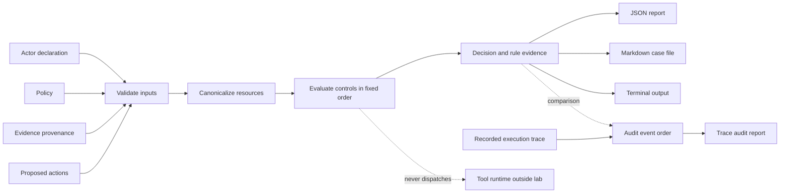

# Architecture

Agentic Security Lab separates policy decisions from tool execution. The core accepts data, validates it, computes a decision, and returns bounded evidence. It has no network client, credential store, tool adapter, or implicit clock.

## Components

| Component | Responsibility | Must not do |
|---|---|---|
| `validation.js` | Reject malformed policies, scenarios, approvals, evidence references, and traces | Repair ambiguous inputs |
| `matchers.js` | Canonicalize resources, match scoped patterns, find narrow secret shapes | Fetch resources or infer identity |
| `engine.js` | Apply actor, policy, approval, provenance, tenant, and resource controls | Execute an action |
| `trace-audit.js` | Check event order and decision-to-completion consistency | Claim that a supplied trace is complete |
| `reporters.js` | Render bounded terminal, JSON, and Markdown evidence | Copy raw action arguments into reports |
| `cli.js` | Load local files, select commands, and map failures to exit codes | Contact a remote service |
| `demo/` | Run curated and edited cases through the same browser-compatible engine | Store cases or transmit their contents |
| `scripts/build-reports.js` | Rebuild checked-in evidence from versioned cases | Hand-edit report outcomes |

## Data flow

## Trust boundaries

### Boundary A: caller to evaluator

Actor identity, tenant, approvals, provenance labels, actions, and evaluation time are asserted by the caller. The evaluator checks their shape and internal consistency. It does not establish their truth.

### Boundary B: evaluator to tool runtime

The evaluator returns a decision but does not enforce it. A runtime adapter must stop dispatch when the decision is `deny`. Trace auditing can detect certain recorded violations after the fact, but it cannot recover an action or prove that unrecorded actions did not occur.

### Boundary C: raw input to report

Reports omit action arguments. Findings expose rule IDs and selected metadata such as resource, approval scope, and evidence identifiers. Secret-like values are classified but not reproduced.

## Determinism

Evaluation time comes from the scenario. No decision depends on the machine clock, network state, random values, or filesystem state. Given the same accepted inputs and engine version, the decision report is stable.

## Dependency boundary

The production evaluator uses the JavaScript standard library only. The browser workbench imports the same engine modules. A new runtime dependency requires an ADR and must explain why a local implementation would be less safe or less maintainable.
