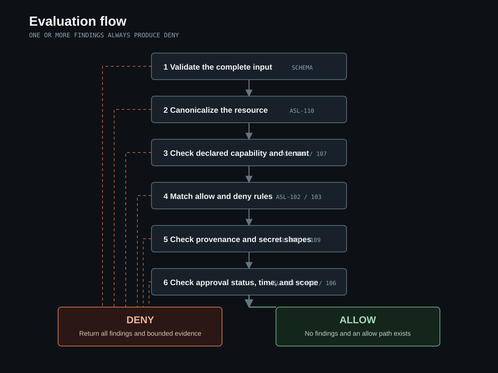

# Decision model

The evaluator denies an action when any control emits a finding. A matching allow rule is necessary under the supplied default-deny policy, but it is never sufficient by itself.

## Decision order

1. Validate the complete scenario and policy.
2. Canonicalize the action resource. Reject ambiguous separators and traversal forms.
3. Check the actor's declared capabilities.
4. Enforce the tenant boundary when both sides identify a tenant.
5. Look for supported secret shapes in action arguments.
6. Match policy rules against capability, operation, and canonical resource.
7. Apply explicit deny precedence.
8. Apply default deny when no allow rule matches.
9. Block untrusted evidence from influencing a sensitive action when the allow rule requests that control.
10. Validate required approval status, lifetime, and exact scope.
11. Return `deny` when one or more findings exist. Otherwise return the matching allow or policy default.

This order is designed to produce useful evidence, not to short-circuit at the first finding. A single action can expose several independent control failures.

## Control catalog

| Rule | Condition | Decision effect |
|---|---|---|
| ASL-101 | Actor did not declare the requested capability | Deny |
| ASL-102 | Default-deny policy has no matching allow rule | Deny |
| ASL-103 | A matching explicit deny rule exists | Deny |
| ASL-104 | A required approval is missing or not approved | Deny |
| ASL-105 | A required approval is expired or has invalid time | Deny |
| ASL-106 | Approval scope misses capability, operation, or resource | Deny |
| ASL-107 | Actor and resource tenants differ | Deny |
| ASL-108 | Supported secret-like material is present in arguments | Deny |
| ASL-109 | Untrusted evidence influenced a protected sensitive action | Deny |
| ASL-110 | Resource form is unsafe or ambiguous | Deny |
| ASL-201 | Trace records tool completion after deny | Trace failure |
| ASL-202 | Trace records completion without a prior decision | Trace failure |

The code-level catalog lives in [`src/rule-catalog.js`](../src/rule-catalog.js). The table explains it but does not replace it.

## Policy matching

Rules match three axes: capability, operation, and resource. All three must match. `*` matches one segment and `**` matches across segments. Resources are canonicalized before matching.

When both an allow rule and a deny rule match, deny wins. Policy order does not change that result.

## Approval semantics

An approval is data attached to one proposed action. A rule may require it. The evaluator checks:

- status equals `approved`;
- expiry is at or after the scenario's `evaluatedAt` value;
- capability, operation, and resource are inside the declared approval scope.

The evaluator does not verify a signature, identity, or approval issuer. That work belongs to Phase 2 adapters.

## Expectation semantics

Every scenario action declares `expectedDecision`. This does not influence the computed decision. It turns a case into an executable assertion: a mismatch makes the scenario fail.

## Trace semantics

Trace events are processed in recorded order. A `tool.completed` event requires a preceding `policy.decision` event with `allow` for the same action. A later allow cannot authorize an earlier completion.
